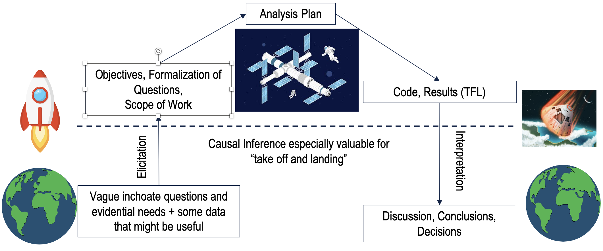
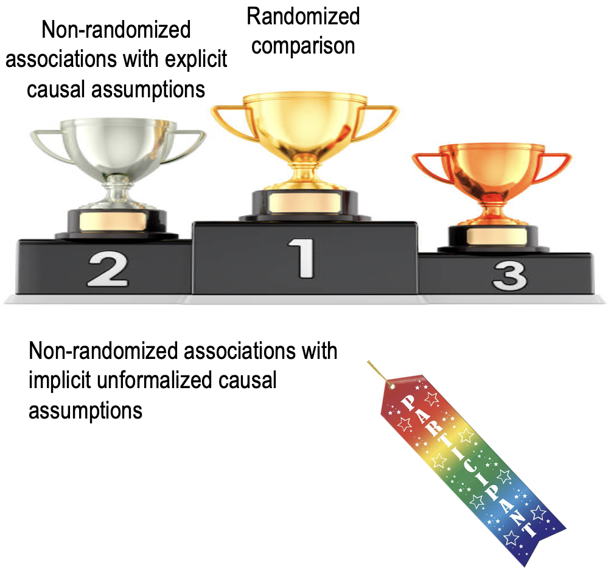

# Introduction

## Why Causal Inference? 

Sound causal reasoning is essential to pharmacometrics (@Rogers2023-kh). A motivating premise of this book is that pharmacometricians will be better able to engage in causal reasoning with stochastic data if they are able to avail themselves of the formal vocabulary, notation, and concepts of formal causal inference. While this book may introduce the reader to some new analytic techniques, our emphasis will be on causal concepts as an aid to elicitation and interpretation, as suggested in the figure below. 

{width=80% fig-align="center"}

Our perspective is that causal reasoning is especially important in pharmacometrics because it is often the case that pharmacometric questions must be addressed without the benefit of a dedicated randomized trial. As such, our goal is often not to provide the gold standard evidence that would result from a randomized trial, but rather to foster high-quality decision making with whatever data is available at the time the decision needs to be made, as suggested in the following figure. 

{width=80% fig-align="center"}

## Motivating Example: The TOGA and HELOISE Trials

## What Causal Inference Doesn't Do

