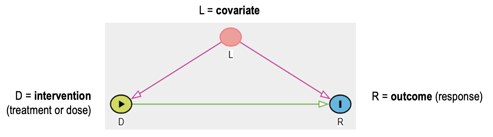

# Causal Directed Acyclic Graphs


```{r setup, include=FALSE}
# Pass the vector directly. Knitr will re-read this vector freshly for EVERY chunk.
knitr::opts_chunk$set(engine.opts = list(
  template = "../tikz_template.tex",
  convert = "dvisvgm" # Keeps your math italics beautiful!
))
```

## What is a Causal DAG?

First, a distinction: the Directed Acyclic Graphs (DAGs) discussed here will be specifically *causal* DAGs which, as the name suggests, convey causal information. In principle, DAGs can also be used to convey non-causal information (e.g. they are sometimes used to specify hierarchical models, which may or may not have causal interpretability), but in the context of this book, a "DAG" can always be understood to have causal semantics attached to it. 

In the context of causal inference, DAGs consist of nodes, representing variables, and "directed edges" (a.k.a. arrows), representing causal dependencies between the variables. A proper DAG will contain only unidirectional arrows and will not contain directed loops ("acyclic"), corresponding to the notion that there can be no instantaneous causal feedback (feedback in general can be represented, but it must proceed in a temporal sequence). You will (very soon) see DAGs that seemingly violate this requirement of directedness by including bi-directional arrows. However, as will soon be explained, bi-directional arrows are only to be understood as a notational shortcut, not as a representation of instantaneous feedback.  

## DAG conventions in this book

Our graphical conventions in this book are intended to be similar to those used in the popular "dagitty" web application (@Textor2016-sb), but with some modifications to better support readers who are red-green colorblind. The conventions we will use are: 

* The pathway(s) of causal dependence that we wish to quantify will be shown in blue (whereas in dagitty they show in green). 
* We won't graphically distinguish between treatment nodes, outcome nodes, and other nodes. However, the previous convention makes it clear how to identify the treatment and outcome nodes, but determining where the blue arrows originate and terminate. 
* Biasing pathways (or unblocked "backdoor paths" to use the technical term that we will discuss later) will be shown in red. 
* Adjusted variables (variables that we control for in our analyses) will be depicted with rectangle-shaped nodes. 
* Causal dependencies that are neither biasing nor of direct interest will be depicted in gray (or "grey", if you prefer).
* Dashed lines to represent potential causal dependencies of a more speculative nature. 

We illustrate these conventions in comparison to dagitty conventions in the following figures: 


{width=80% fig-align="center"}

```{r, echo = FALSE}
#| engine: tikz
#| fig-ext: png
#| fig-dpi: 300

    \begin{tikzpicture}[->,>=Stealth]
    \node[] (D) at (0,0) {$\underline{D}$};
    \node[] (L) at (2.5,1) {$L$};
    \node[] (R) at (5,0) {$\overline{R}$};
    
      \path 
    	(D)  edge  [very thick, color=blue]  (R)  
    	(L)  edge  [very thick, color=red]  (D)			
    	(L)  edge  [very thick, color=red]  (R)			
    	;
    \end{tikzpicture}
```

If we then wish to depict the same relationships, but with adjustment for $L$, we will use:

```{r, echo=FALSE}
#| engine: tikz
#| fig-ext: png
#| fig-dpi: 300

    \begin{tikzpicture}[->,>=Stealth]
    \node[] (D) at (0,0) {$D$};
    \node[draw] (L) at (2.5,1) {$L$};
    \node[] (R) at (5,0) {$R$};
    
      \path 
    	(D)  edge  [very thick, color=blue]  (R)  
    	(L)  edge  [very thick, color=gray]  (D)			
    	(L)  edge  [very thick, color=gray]  (R)			
    	;
    \end{tikzpicture}
```

## Examples of DAGs in Drug Development

### Trastuzumab in Gastric Cancer: Conounding due to Cachexia

```{r, echo=FALSE}
#| engine: tikz
#| fig-ext: png
#| fig-dpi: 300

    \begin{tikzpicture}[->,>=Stealth]

   

    \node[] (Lcl) at (0,6) {$L_{\mathit{CL}}$};
    \node[] (CL) at (3,6) {$\mathit{CL}$};
    \node[] (Lshared) at (6,6) {$L_{\mathrm{shared}}$};
    
    \node[] (E) at (3,3) {$E$};
    \node[] (R) at (6,3) {$R$};
    
    \node[] (D) at (3,0) {$D$};
    \node[] (Lr) at (6,0) {$L_R$};

      \path 
    	(Lcl)  edge  [very thick, color=gray]  (CL)  
    	(Lshared)  edge  [very thick, color=red]  (CL)			
    	(CL)  edge  [very thick, color=red]  (E)
      (E) edge  [very thick, color=blue]  (R)
      (Lshared) edge  [very thick, color=red]  (R)
      (D) edge  [very thick, color=gray]  (E)
      (Lr) edge  [very thick, color=gray]  (R)
    	;
    \end{tikzpicture}
```
